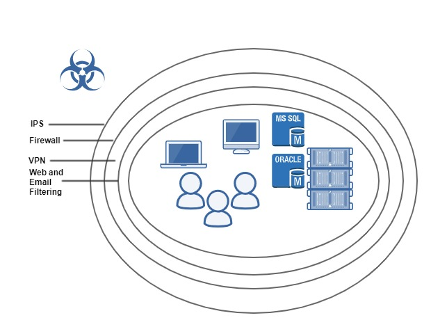

# Emerging Threats & Endpoint Protection 

---
## PERIMETER SECURITY
@snap[east span-30]

@snapend

+++
## Perimeter Security and need for  Endpoint Security
* Work force is increasingly mobile
* Business from anywhere and anytime
* Dependency on computers/networks for every transaction in life
* Open public network

Perimeter security for DC and corporate network
Endpoints going out side digital fortress 

---
## Different Types Attacks 
* Virus
* Trojan
* Adware
* Spyware
* Botnet CNC
* Malware
* Phishing
* Man-in-the-middle attack
* Denial-of-service attack
* Ransomware 
* APT: Stuxnet, Flame
* Nation State Actors

---

## Antivirus Solution 
* How traditionally they have been working 

* New Antivirus Approach
* File less attacks / Memory exploit mitigation 
* Advance machine learning 
* Intrusion prevention 
* Cloud Intelligence 
* Virtual Patching 
* DLP, EDR

---
## Symantec Endpoint Protection 
* Internal Processes 
* Network and Host Exploit Mitigation
* Discovery of most of new Machines

---

>“SEP 14 and, most recently, SEP 14.1 have proven to be very stable and efficient on resources. Clients report that the addition of >ML and other advanced anti-malware capabilities have improved threat and malicious software detection, and containment.”

>“Symantec's broad deployment across a very large deployment population of both consumer and business endpoints provides it >with a very wide view into the threat landscape across many verticals.”

---

## Windows Patches 
## Client Web Suite

---
What Support we need 

[x] Review your machines regularly
[x]  Review LAB machines and their software updates 
- [x]  Cooperate CSD/FM Engineer with information
- [x]  Restart machines regularly
- [x]  Motitor C drive space 
- [x]  Internet acivities 

